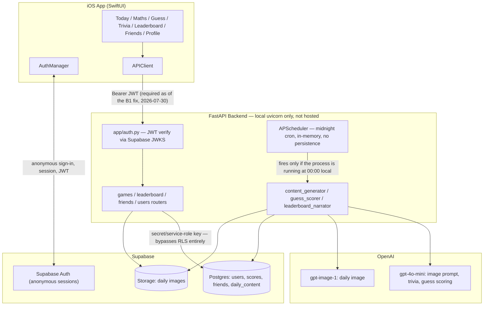
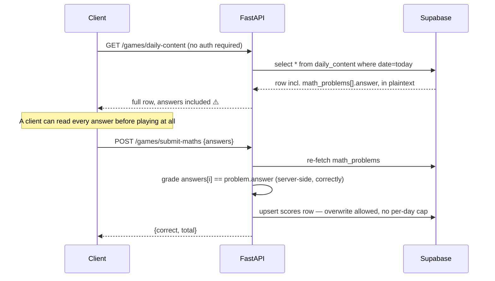
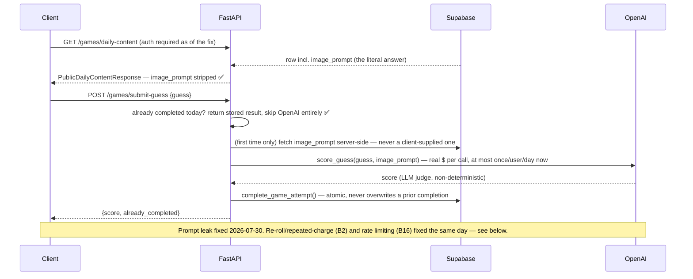

# Blipz Production & App Store Readiness Audit

**Date:** 2026-07-30
**Scope:** `blipz-backend` (FastAPI) + `blipz-ios/Blipz` (SwiftUI)
**Method:** Direct code inspection with file/line citations. Nothing below is speculative —
every finding was verified by reading the actual code, running `pytest`, checking `git`
history/`.gitignore`, or testing the live local server. Where something couldn't be verified
from code (e.g. Supabase dashboard access policy), that's stated explicitly rather than guessed.

This document does not implement fixes — per instruction, it's audit + roadmap only.

**2026-08-01 update:** see `docs/DEPLOYMENT.md` for the hosting comparison,
environment strategy, and full deployment/rollback runbook produced for B14/B20/B22 —
summarized inline at each relevant finding below, not duplicated in full here.

---

## 1. Current architecture



**Key architectural fact:** the backend authenticates every request via `app/auth.py`
(Supabase JWT verification), then talks to Postgres with the **secret/service-role key**
(`app/database.py`), which bypasses Row-Level Security entirely. This means **RLS policies on
`users`/`scores`/`friends`/`daily_content` provide zero real protection today** — the actual
(and only) security boundary is the FastAPI auth + authorization layer. This is fine *as long
as the iOS app never talks to Supabase directly* — confirmed it currently doesn't (all iOS
network calls go through `APIClient` → the FastAPI backend).

---

## 2. Data flow per game

### Quick Maths — data flow as it was before the 2026-07-30 fix



The grading logic itself is correct (server computes correctness, doesn't trust a
client-sent score) — the leak was entirely in what `GET /games/daily-content` exposed.

> **✅ Fixed 2026-07-30.** The endpoint now requires authentication and returns
> `PublicMathProblem`/`PublicTriviaQuestion`/`PublicDailyContentResponse` (see
> `app/models/schemas.py`) instead of the raw row. **`math_problems[].answer` is the one
> field intentionally kept** — Quick Maths' "type the correct number to auto-advance"
> mechanic checks answers on-device with no network round trip per keystroke, and
> redesigning that was explicitly out of scope for this fix. This remains a documented,
> accepted residual risk: a client can still read `answer` and submit a perfect Maths
> score without playing. Trivia and Guess no longer have this problem at all (see below).

### Daily Trivia — ✅ fixed 2026-07-30 (answer leak), ✅ fixed 2026-07-31 (grading, see B24)

`trivia_questions[].answer` is no longer returned by `GET /games/daily-content` — the
endpoint now returns `PublicTriviaQuestion` (id/question/category/options only).
`/submit-trivia` was already grading server-side by re-fetching the real answers — but
**that grading was itself broken** (see **B24**): it compared submitted option text
against a stored option letter, which never matched for any real content. This was only
caught the next day, during live verification of an unrelated fix, not as part of this
2026-07-30 pass. `TriviaGameView`'s per-question correct/incorrect reveal (from an
earlier polish pass) was removed here since it depended on the client having `answer`;
it came back on 2026-07-31 as a post-submission review screen (`GET
/games/trivia-review`), which is also where the id-based grading fix's correctness is
now visible to the player.

### AI Prompt Guess — ✅ fixed 2026-07-30 (prompt leak, and now B2/B16 below too)



---

## 3. Threat & failure-mode analysis

### Critical: game integrity is currently broken

| ID | Finding | File | Risk |
|----|---------|------|------|
| **B1** | ✅ **Fixed 2026-07-30.** `GET /games/daily-content` was fully unauthenticated and returned `trivia_questions[].answer` and `image_prompt` (the Guess answer) in plaintext, before the user played. Now requires auth and returns allowlisted `Public*` response models with those fields stripped. `math_problems[].answer` is intentionally still returned (documented exception — see the Quick Maths data-flow section above); everything else about the original finding is closed. Regression tests: `tests/test_daily_content_security.py`. | `app/routers/games.py`, `app/models/schemas.py` | Residual: a client can still read `math_problems[].answer` and submit a perfect Maths score without playing — accepted, not fixed, by design (see rationale above). |
| **B2** | ✅ **Fixed 2026-07-30.** `submit_guess`/`submit_maths`/`submit_trivia` now all go through `complete_game_attempt()`, which checks completion state before writing and uses an atomic conditional UPDATE (`.eq(completed_field, False)`) as a compare-and-swap guard — a repeated submission returns the original stored result (`already_completed: true`) instead of recomputing or overwriting. Guess's concurrency-cost residual (two simultaneous first requests both calling OpenAI) is now fully closed — see **B23**. Tests: `tests/test_daily_attempt_enforcement.py`. | `app/routers/games.py` (`complete_game_attempt`) | None remaining for storage integrity; see B23 for the OpenAI-call-count guarantee. |
| **B23** | ✅ **Implemented 2026-08-01 — migration pending.** Guess now uses an explicit, DB-backed reservation state machine (`guess_status`: `not_started` → `scoring` → `completed`/`failed`, plus `guess_scoring_started_at`) so **at most one request can ever be actively scoring a given user/day's Guess attempt**, closing B2's residual concurrency-cost window entirely rather than just bounding it. `acquire_guess_scoring_slot()` claims the transition atomically via conditional `UPDATE ... WHERE guess_status IN (...)` (never a plain check-then-write); a concurrent request that finds `scoring` in progress briefly re-polls (bounded to ~2s) and either returns the completed result or a `202 {"status": "scoring_in_progress"}` — it never calls OpenAI itself. On an OpenAI failure, the reservation is explicitly released to `failed` (immediately retryable, rate-limiter-throttled) rather than left stuck; a reservation left in `scoring` past `GUESS_SCORING_STALE_AFTER_SECONDS` (30s, e.g. from a crashed process) is safely reclaimable by a later request via an optimistic-concurrency guard on the exact prior timestamp. Tests: `tests/test_guess_scoring_reservation.py` (11 tests incl. real concurrent-request scenarios via `ThreadPoolExecutor`, stale-reclaim, failure-then-retry). **Migration required and not yet applied** — see `sql/migrations.sql`'s latest block; live/concurrency verification pending the user applying it. | `app/routers/games.py` (`acquire_guess_scoring_slot`, `submit_guess`) | None once the migration is applied and live-verified; until then, the code path isn't reachable in production (existing behavior unchanged — old columns don't exist yet). |
| **B24** | ✅ **Fixed 2026-07-31. Release blocker.** `/submit-trivia` graded by comparing the submitted answer against `daily_content.trivia_questions[].answer`, which was always stored as an option **letter** (`"A"`/`"B"`/`"C"`/`"D"`) — but iOS submitted the full **option text** the user tapped (e.g. `"Renegade"`). `"Renegade" == "A"` never matched, so **every real (non-placeholder-content) Trivia attempt was graded wrong regardless of what the player picked**, since the very first commit that implemented Trivia scoring (`ebae4c4`). It went undetected because two early dev-data days happened to use placeholder content whose options were literally the strings `"A"/"B"/"C"/"D"`, which could coincidentally match the stored letter. Fixed by changing the contract: `daily_content` questions are now normalized at generation time to `{id, question, category, options, correct_option_id}` (see `content_generator.normalize_trivia_questions` — also validates exactly 4 unique non-empty options and a real A-D answer, retrying generation once on malformed model output); the client submits `{question_id, selected_option_id}` pairs (`selected_option_id` pattern-validated to `^[A-D]$`); the backend grades by comparing ids, never text, and rejects submissions with missing/duplicate/extra/unknown `question_id`s. `GET /games/trivia-review` now returns both the id and human-readable text for the selected and correct answers. Old daily_content rows generated before this fix (using `answer` instead of `correct_option_id`, no `id`) still read correctly via a positional fallback — no content backfill needed. Regression tests: `tests/test_trivia_grading.py`, `tests/test_content_generator.py`. Live-verified against real (non-placeholder) content: a real authenticated submission of the actual correct option text, mapped to its position's id, scored 5/5. | `app/agents/content_generator.py`, `app/models/schemas.py`, `app/routers/games.py` | Historical dev data: one `scores` row (2026-07-30) was graded under the broken logic and its raw answers were never stored, so it could not be reconstructed — its Trivia fields were reset 2026-07-31 (see §5). No production users existed at the time of this bug — nothing to notify or refund. |
| **B3** | Guess scoring interpolates the raw player-supplied guess text directly into the LLM prompt with no delimiter/sanitization. | `app/agents/guess_scorer.py:44` | Prompt-injection vector — a crafted guess could attempt to manipulate the judge into returning a maximal score. |

### Daily content pipeline

| ID | Finding | File | Risk |
|----|---------|------|------|
| **B4** | ✅ **Substantially fixed 2026-08-01 — deployment pending.** `generate_content_for_date()`/`publish_content_for_date()` (see the deployment plan below and `docs/DEPLOYMENT.md`) validate the entire package (image generated + uploaded + upload-reachability-verified, all 5 Trivia questions validated, retried once) before ever writing a row — a failure raises and stores nothing, logged to `daily_content_generation_log`. If nothing is `ready` by publish time, a prevalidated fallback package is activated automatically instead of leaving the day broken. Not yet live: this only takes effect once actually deployed and the external cron is wired up (see §"Hosted deployment" below). | `app/agents/content_generator.py` | Residual: image *generation itself* retries 0 times (only Trivia retries once) — a transient OpenAI image failure still falls through to the fallback path rather than a same-attempt retry; acceptable given the fallback exists, but worth tightening later. |
| **B5** | ✅ **Fixed 2026-08-01 (design), deployment pending.** The in-process `AsyncIOScheduler` now only starts when `ENVIRONMENT=development` (`app/main.py`) — staging/production rely on the host's own scheduled-job feature (Render Cron Jobs in the recommended plan) hitting the protected `/admin/generate-content` and `/admin/publish-content` endpoints, which has real misfire/retry semantics unlike an in-process job tied to one process's uptime. | `app/main.py`, `render.yaml` | None once actually deployed with the cron jobs configured; until then this is local-dev-only, matching the status quo. |
| **B6** | No content moderation step before publishing the AI-generated image/prompt to all users. | `app/agents/content_generator.py` | OpenAI's own image-gen safety system provides some protection (surfaces as B4's failure mode if triggered), but there's no app-level review/reporting mechanism — likely an App Review question for AI-generated user-facing content. |
| **B7** | ✅ **Fixed 2026-08-01 (design), deployment pending.** Generation and publication are now separate operations — a Render Cron Job is intended to generate tomorrow's content well before the boundary (22:00 UTC in `render.yaml`), giving hours of margin to retry before publication (00:05 UTC) needs anything ready. | `render.yaml`, `app/agents/content_generator.py` | None once deployed; the retry margin only exists once the cron schedule is actually running. |

### Authentication & identity

| ID | Finding | File | Risk |
|----|---------|------|------|
| **B8** | `signInIfNeeded()` uses `try?` around session restoration; if the stored session fails to restore/refresh for *any* reason (revoked refresh token, Keychain wipe, device restore — not just reinstall), it silently falls through to `signInAnonymously()`, minting a **brand-new identity**. There is no account-linking/upgrade flow anywhere. | `Blipz/Services/AuthManager.swift:19-28` | Permanent, silent loss of streak/scores/friends with no warning and no recovery path. This is the single biggest identity-durability risk in the app. |
| **B9** | If sign-in fails entirely, `isReady = true` still executes unconditionally, so the app renders `MainTabView` with no valid session — every API call then fails with an opaque `"Unknown server error"`. | `AuthManager.swift:27`, `APIClient.swift:38-42` | Broken app state with no retry UI, would look like a crash-adjacent bug to App Review or real users. |
| **B10** | JWT verification itself is done correctly (real JWKS, explicit `ES256` allowlist, audience check) — **no finding here**, called out so it's not mistaken for a gap. | `app/auth.py:17,31-32` | — |

### Social features

| ID | Finding | File | Risk |
|----|---------|------|------|
| **B11** | Adding a friend is unilateral — no request/accept step, no notification, and **no unfriend/block endpoint exists at all**. Any user can add anyone (if they know/guess the username) and permanently see that person's daily scores. | `app/routers/friends.py` (only `/add` and `/list` exist) | Non-consensual visibility relationship with no removal path — a real privacy problem and a plausible App Review rejection reason for social features. |
| **B12** | Add-friend returns 404 for unknown usernames vs 200 for known ones, allowing username enumeration; compounds B11. | `app/routers/friends.py:13-15` | Low-effort scraping of which users exist, then friending/viewing them. |
| **B13** | No endpoint anywhere lets a user change their username — permanently stuck with the auto-generated `guest_XXXXXXXX` handle. | confirmed absent in `app/routers/users.py`, `friends.py` | Product gap that meaningfully hurts a social/leaderboard-driven app (nobody wants to be "guest_d366ce2a" forever). |

### Operational readiness

| ID | Finding | File | Risk |
|----|---------|------|------|
| **B14** | ⏳ **Plan + repository changes ready 2026-08-01, not yet deployed.** Full hosting comparison (Render/Railway/Fly.io), `render.yaml`, updated `Dockerfile` (non-root user, `$PORT` support, `HEALTHCHECK`), and a full runbook are in `docs/DEPLOYMENT.md`. **Deliberately not deployed** — deploying creates a billable resource and needs explicit approval first. | `render.yaml`, `Dockerfile`, `docs/DEPLOYMENT.md` | Still a release blocker until actually deployed — a plan isn't a running server. |
| **B15** | ✅ **Fixed 2026-08-01.** `CORSMiddleware` now uses `settings.cors_allowed_origins_list` (empty by default) and only enables `allow_credentials` when origins are explicitly configured — never wildcard-origin-plus-credentials again. Native iOS doesn't depend on CORS at all; this only matters if browser-based tooling is added later. | `app/main.py`, `app/config.py` | None — revisit only if/when a web client is added, by setting `CORS_ALLOWED_ORIGINS` for that environment. |
| **B16** | ✅ **Partially fixed 2026-07-30.** `POST /games/submit-guess` now has `@limiter.limit("10/minute")` (slowapi, keyed by IP). Still no rate limiting on any other route. Uses slowapi's default in-memory storage — **not sufficient once the backend runs on more than one process/instance** (each instance tracks its own counter independently); revisit with a shared store (e.g. Redis) before scaling out. Also keyed by IP, not authenticated user, as a simplification — doesn't perfectly isolate abuse by one user across IPs or protect users sharing an IP/NAT. | `app/rate_limit.py`, `app/routers/games.py` | Cost/abuse exposure remains on every other route; the fixed route's protection weakens under multi-instance deployment. |
| **B17** | ✅ **Partially fixed 2026-08-01.** Structured logging now exists throughout the daily-content pipeline, Guess scoring failures, and app startup (`app/logging_config.py`) — never logging API keys, full tokens, raw guess text, or hidden image prompts. `GET /health`, `GET /health/ready`, and `GET /admin/content-status` give real operational visibility. **No external alerting (Sentry or similar) yet** — someone still has to look at logs/the status endpoint; nothing pages anyone automatically. | `app/logging_config.py`, `app/main.py`, `app/routers/admin_content.py` | Silent failures are now observable (not invisible) but still not proactively alerted on. |
| **B18** | ✅ **Fixed 2026-08-02.** Audited all 34 Blipz Swift files plus all 9 resolved SPM dependencies for required-reason API usage — zero direct usage in app code. Found one indirect usage: `supabase-swift`'s `Storage` module (a hard dependency of the `Supabase` product Blipz links) calls `FileManager.attributesOfItem(atPath:)` to size a file before upload. Confirmed via `strings` on the actual linked Debug/Release binaries that this selector is present in what ships, even though Blipz's own code never calls Storage upload (all image storage is server-side). Declared `NSPrivacyAccessedAPICategoryFileTimestamp` with reason `C617.1` (own-container internal use) — the first attempt used `0A2A.1`, which was wrong (that code is reserved for a third-party SDK declaring a wrapper *the app explicitly calls*, not for a linked-but-uninvoked code path); corrected after verifying Apple's actual reason definitions. `supabase-swift` ships no manifest of its own for this. | `Blipz/PrivacyInfo.xcprivacy` | None — verified present in both build products, valid plist, both configurations build. |
| **B19** | No account-deletion flow exists anywhere in the iOS app (no settings screen, not even sign-out). | confirmed absent, `Blipz/Views/` | Apple App Review Guideline 5.1.1(v) requires in-app account deletion for apps that support account creation — anonymous Supabase accounts likely qualify. |
| **B20** | ⏳ **Code ready 2026-08-01, URL handoff pending.** `Config.swift` is now environment-aware (Debug/Staging/Release via `Blipz/Configs/*.xcconfig`), with an explicit placeholder (`REPLACE_WITH_{STAGING,PRODUCTION}_BACKEND_URL`) for Staging/Release rather than a real or guessed URL — `fatalError`s at launch if the placeholder is still present, or if a non-Debug build somehow points at localhost. Debug keeps working locally via a compiled-in fallback. **Still blocked on B14** — there's no real hosted URL to put in these files until deployment happens. | `Blipz/Services/Config.swift`, `Blipz/Configs/*.xcconfig` | Compounds B14 until deployed; once deployed, updating the two placeholder lines is the entire remaining step. |
| **B21** | ✅ **Fixed 2026-08-02.** Audited every Swift file for API/language-version requirements — the real floor is iOS 17.0, driven by `@Observable` (used in all 7 view models), two/zero-parameter `.onChange(of:)` closures, and `.contentTransition(.numericText(value:))`. Lowered from `26.0` to `17.0` (not lower — `@Observable` is too architectural to rewrite for this). Verified via clean Debug and Release builds with zero availability errors, confirming no accidental iOS 18/26-only API usage exists anywhere in the app. | `project.pbxproj` | None — this was the previously-untested assumption; now empirically confirmed by a passing build at the new floor. |
| **B22** | ✅ **Fixed 2026-08-01.** UTC is now the explicit, documented day boundary (`app/time_utils.py`) — every `date.today()` call in `games.py`/`content_generator.py` that determines "today"/"tomorrow" for game state or daily content was replaced with `utc_today()`/`utc_tomorrow()`. This was a decision that needed making, not a bug to "fix" further — see `docs/DEPLOYMENT.md` §3. | `app/time_utils.py`, `app/routers/games.py`, `app/agents/content_generator.py` | None — this is now a recorded, intentional choice rather than an accident of server locale. |

### Confirmed non-issues (checked, no finding)

- OpenAI key never reaches the client or logs — clean (`app/config.py`, grep for key patterns).
- No hardcoded secrets in the iOS app beyond the intentional public Supabase key (`Config.swift`).
- No SQL injection surface — everything goes through the parameterized supabase-py query builder.
- No over-exposure of private fields (email, etc.) to other users via leaderboard/friends.
- `.env` is correctly gitignored and has never been committed (`git log --all -- .env` empty).
- Global leaderboard is already capped (`LIMIT 50`) — not an unbounded-fetch risk.
- Friends-leaderboard authorization correctly scopes to the requesting user's own `user_id` from the verified JWT — no cross-user data leak found there.

---

## 4. App Store release-blocker list

These must be fixed before any TestFlight/App Review submission, in rough order of how much
they block everything else:

1. ~~**B1** — public endpoint leaks all three games' answers.~~ **✅ Fixed 2026-07-30**
   (Trivia/Guess fully; Maths answer intentionally kept, see finding B1 above). (Backend)
2. ~~**B24** — Trivia graded submitted option text against a stored option letter,
   silently scoring every real attempt wrong.~~ **✅ Fixed 2026-07-31** — see B24 above.
   (Backend + iOS)
3. **B14 + B20** — ⏳ plan + code ready (`docs/DEPLOYMENT.md`), **not yet deployed** — still
   blocks App Review until an actual HTTPS URL exists and iOS points at it. (Deployment + iOS)
4. **B19** — no account-deletion flow. (iOS + Backend)
5. ~~**B18** — no `PrivacyInfo.xcprivacy`.~~ **✅ Fixed 2026-08-02** (iOS)
6. **B8** — silent identity loss on session-restore failure, no recovery. (iOS)
7. **B11** — non-consensual, unremovable friending. (Backend + iOS)
8. ~~**B15** — wildcard CORS + credentials.~~ **✅ Fixed 2026-08-01** (Backend)
9. ~~**B17** — no alerting on scheduler failure.~~ **✅ Partially fixed 2026-08-01** — structured
   logging + health/status endpoints exist; no external paging yet. (Backend)
10. ~~**B2 + B16** — unlimited OpenAI cost exposure via unthrottled `submit-guess`.~~
    **✅ Fixed 2026-07-30** (Backend) — rate limiting still needed on other routes; see B16 above.
11. ~~**B4 + B5 + B7** — content pipeline has no retry/fallback/buffer.~~ **✅ Fixed 2026-08-01
    (design), not yet deployed** — takes effect once B14 is deployed and the cron jobs run.
    (Backend)

---

## 5. Recommended database/schema changes

- ✅ **Done 2026-07-30**: added `maths_completed`, `guess_completed`, `trivia_completed`
  boolean columns to `scores` (plus `maths_elapsed_seconds`, `guess_text`,
  `trivia_answers` for the Maths plausibility check, idempotent Guess replay, and
  Trivia review respectively), set explicitly by `complete_game_attempt()` at the
  moment of a genuine first completion and never overwritten after. This is a
  **transitional design**, not the full `daily_game_attempts` table originally
  sketched here — see the design-rationale note in `sql/migrations.sql` for why: the
  leaderboard, streak, and Today/Profile read paths are all built around one flat
  `scores` row per user/day, and reworking that aggregation was disproportionate churn
  relative to what closing the actual security gap required. Revisit if per-attempt
  history/analytics become a real product need later.
- ✅ **Done 2026-08-01**: added `guess_status` (`not_started`/`scoring`/`completed`/`failed`,
  CHECK-constrained) and `guess_scoring_started_at` to `scores` (fixes B23) — an explicit
  reservation the backend must atomically hold before it's allowed to call OpenAI for Guess
  at all, closing the concurrency-cost window that B2's completion CAS didn't cover (that
  CAS only guaranteed one *stored* result, not one *OpenAI call*). Added directly to the
  existing `scores` row rather than a separate reservation table — same rationale as the
  transitional design above.
- ⏳ **Code done 2026-08-01, migration not yet applied**: added `status`
  (`draft`/`ready`/`published`/`failed`, **defaults to `draft`**), `generated_at`,
  `published_at`, `is_fallback`, `fallback_source_id` to `daily_content`, plus two new
  tables: `daily_content_generation_log` (audit trail for the generate/publish
  pipeline) and `fallback_daily_content` (the emergency package pool) — see
  `docs/DEPLOYMENT.md` §3 and `sql/migrations.sql`'s latest block. The `draft` default
  is a deliberate fail-safe: an insert that forgets to specify `status` can never
  accidentally become publicly servable — only an explicit transition to `published`
  (via `publish_content_for_date`/`activate_fallback_for_date`) makes a row visible to
  `GET /games/daily-content`. Confirmed neither insert/upsert path in
  `content_generator.py` relies on this default — both always set `status` explicitly.
  The 5 pre-existing rows are explicitly backfilled to `published` (not left to the
  new default) since they were historically already live. **Do not assume this
  migration is applied** — every new backend test that depends on it is gated behind a
  skip check (see `tests/conftest.py`) and currently skips, not fails.
- Consider a `friends` table `status` column (`pending`/`accepted`) to support a real
  request/accept flow (fixes B11), plus the missing `DELETE /friends/{id}` endpoint.
- Add a `username` uniqueness/change audit if usernames become editable (fixes B13) —
  confirm the existing `UNIQUE` constraint semantics are preserved.
- Longer-term (not a blocker): a per-attempt table (`user_id, daily_content_id, game_type,
  started_at, completed_at, score`) for real analytics and anti-cheat signal, as originally
  suggested.
- **Historical dev-data audit (B24) — ✅ cleanup done 2026-07-31**: of the 2 rows in
  `scores` at the time of the fix, one (`id=5b92729d-5e7a-4524-bfe4-134430c47349`,
  `date=2026-07-30`, was `trivia_score=2`, `trivia_completed=true`) was graded under the
  broken text-vs-letter comparison. Its `trivia_answers` was `NULL` (the row predates
  that column's population), so there was no record of what was actually submitted —
  **reconstruction was not possible** by any of stored answers, daily content, or
  question ordering. Since the app has no production users, the row's Trivia fields were
  reset rather than guessing a score or deleting the whole row:
  ```sql
  UPDATE scores
  SET trivia_score = 0,
      trivia_completed = false,
      trivia_answers = NULL,
      total_score = maths_score + guess_score
  WHERE id = '5b92729d-5e7a-4524-bfe4-134430c47349';
  ```
  Verified before and after: `maths_score` (20) and `guess_score` (0.0) unchanged;
  `trivia_score` is now `0`, `trivia_completed` is `false`, `trivia_answers` is `NULL`,
  `total_score` is `20.0` (`= maths_score + guess_score`). No other row was touched — the
  other row (2026-07-29) already had `trivia_completed=false`/`trivia_score=0` and needed
  no change.

---

## 6. Recommended hosted deployment architecture

**✅ Designed and implemented 2026-08-01, not yet deployed** — see `docs/DEPLOYMENT.md` for
the full hosting comparison (Render/Railway/Fly.io), recommendation (Render, ~$7/mo Starter),
environment strategy, and deployment/rollback runbook. Summary of what changed since this
section was first written:

- **Backend hosting:** `render.yaml` added (1 web service + 2 cron jobs); `Dockerfile` now
  runs as a non-root user, supports `$PORT`, and has a `HEALTHCHECK` against `/health`.
- **Scheduler reliability:** the in-process `APScheduler` now only starts when
  `ENVIRONMENT=development` (`app/main.py`) — staging/production rely on Render's Cron Jobs
  hitting the new `/admin/generate-content` (ahead of time) and `/admin/publish-content` (at
  the boundary) endpoints instead, fixing B5 without relying on one process's uptime.
- **Environment separation:** `ENVIRONMENT`/`CORS_ALLOWED_ORIGINS`/`LOG_LEVEL` added to
  `app/config.py`; CORS now defaults to no origins + no credentials (fixes B15).
- **Observability:** structured logging (`app/logging_config.py`) plus `/health`,
  `/health/ready`, and `/admin/content-status` (fixes B17 partially — still no external
  paging/Sentry).
- **Secrets:** `render.yaml` marks all real secrets `sync: false` (entered manually in the
  Render dashboard, never committed); `.env.example` documents the required keys without
  real values; `require_admin_token` now uses `secrets.compare_digest`.

---

## 7. Ordered implementation roadmap

1. ~~**Fix B1 (answer leak)**~~ **✅ Done 2026-07-30** — Trivia's `answer` and Guess's
   `image_prompt` no longer appear in the public payload; the endpoint now requires auth.
   Maths' `answer` stays exposed by design (see rationale above).
2. ~~**Fix B2 + add submission guards**~~ **✅ Done 2026-07-30** — resubmission now
   returns the original result instead of overwriting (see §5's schema change).
3. ⏳ **Deploy the backend** (fixes B14) — plan, `render.yaml`, and Dockerfile are ready
   (`docs/DEPLOYMENT.md`); **actually creating the Render resources still needs your explicit
   approval** since it's a billable action.
4. ⏳ **Point iOS at the real backend URL** (fixes B20) — `Config.swift` + xcconfig files are
   ready with explicit placeholders; blocked on #3 for a real URL to put in them.
5. ~~**Lock down CORS**~~ **✅ Done 2026-08-01** (fixes B15).
6. **Add account deletion** (fixes B19) — iOS settings entry point + backend endpoint that
   removes/anonymizes the user's rows across `users`/`scores`/`friends`.
7. ~~**Add `PrivacyInfo.xcprivacy`**~~ **✅ Done 2026-08-02** (fixes B18) — required-reason
   API declarations only; the separate data-collection "nutrition label" is not yet done.
8. **Fix identity durability** (B8/B9) — surface a real error/retry UI instead of silently
   minting a new identity; account-linking is a bigger future project, but at minimum stop the
   silent data loss.
9. **Friends: add accept/decline + unfriend** (fixes B11/B12).
10. **Add basic rate limiting** (fixes B16) on `submit-guess` at minimum.
11. **Add Sentry/error tracking** (fixes B17) for the scheduler and API — structured
    logging + `/health`/`/admin/content-status` exist now; still no external paging.
12. ~~**Content pipeline hardening**~~ **✅ Done (design) 2026-08-01** (fixes B4/B7; B6
    moderation still open) — pre-generation, retry, and fallback all implemented; takes
    effect once #3 is deployed and the cron jobs run.
13. ~~**Lower iOS deployment target**~~ **✅ Done 2026-08-02** (fixes B21) — 26.0 → 17.0,
    the real floor set by `@Observable` and two other iOS-17-only features.
14. ~~**Decide and document the daily-reset timezone**~~ **✅ Done 2026-08-01** (fixes
    B22) — UTC, see `app/time_utils.py`.
15. **Username editability** (fixes B13) — product improvement, not a blocker, but cheap
    relative to its value once the account model is otherwise stable.
16. ~~**Close the Guess concurrency-cost window**~~ **✅ Implemented 2026-08-01** (fixes
    B23) — migration applied 2026-08-01; see §5 and B23 above.
17. ⏳ **Seed the emergency fallback pool** (`POST /admin/seed-fallback-content`) and
    apply the pending schema migration (§5) before relying on #12 in production.

---

## 8. Suggested TestFlight acceptance criteria

Before inviting external testers:

- [ ] Backend is reachable at a real HTTPS URL from outside the local network (B14/B20)
- [x] `GET /games/daily-content` no longer exposes Trivia's answer or Guess's
      image_prompt (B1, fixed 2026-07-30) — Maths' answer remains, by design
- [x] Each game can only be scored once per day per user, server-enforced (B2, fixed
      2026-07-30) — pending live verification of `tests/test_daily_attempt_enforcement.py`
      once the migration is applied in this environment (currently skipped, not failing)
- [ ] A missed/failed daily-content generation sends a real alert, not just a log line (B17)
- [ ] Session-restore failure shows a real error/retry state, not a silently new identity (B8/B9)
- [ ] CORS is no longer wildcard-open in whatever environment testers hit (B15)
- [ ] Basic rate limiting exists on `submit-guess` (B16)

## 9. Suggested App Store submission checklist

- [x] `PrivacyInfo.xcprivacy` present and accurate (B18) — required-reason APIs only;
      data-collection nutrition label still not done
- [ ] In-app account deletion implemented and tested end-to-end (B19)
- [ ] Friends require some form of consent, and can be removed (B11)
- [ ] Privacy policy URL set in App Store Connect and reachable
- [x] Deployment target reviewed for real-world device coverage (B21) — 17.0
- [ ] App Review can complete the full daily loop (sign in → play all 3 → leaderboard →
      friends → profile) against the live production backend
- [ ] Screenshots, description, keywords, support URL prepared (currently not started)
- [ ] Content-moderation/reporting story documented for the AI-generated daily image (B6)
