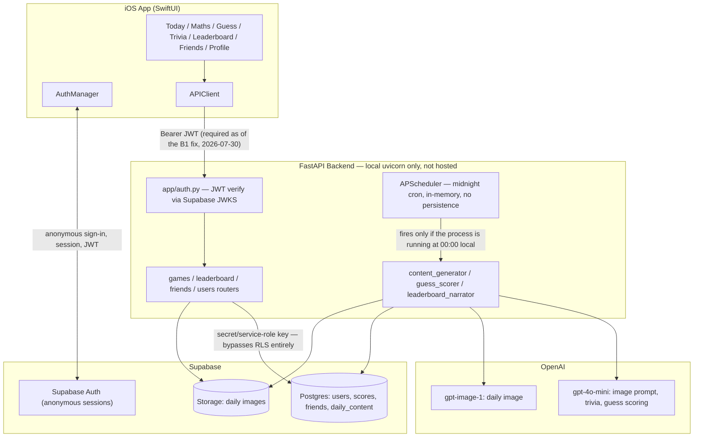
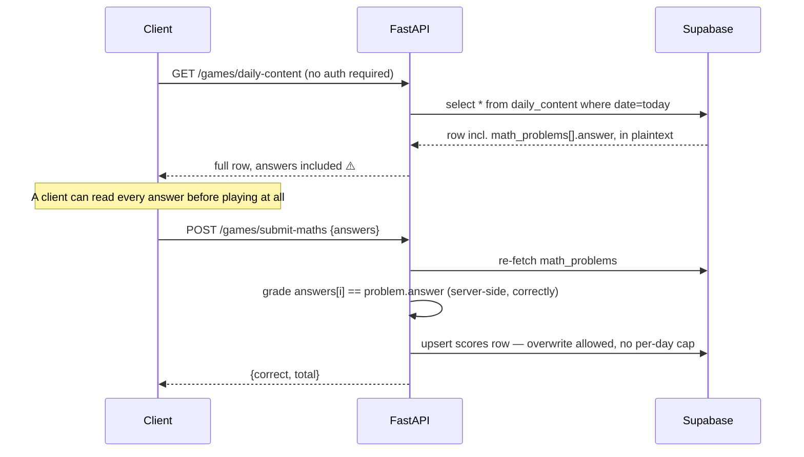
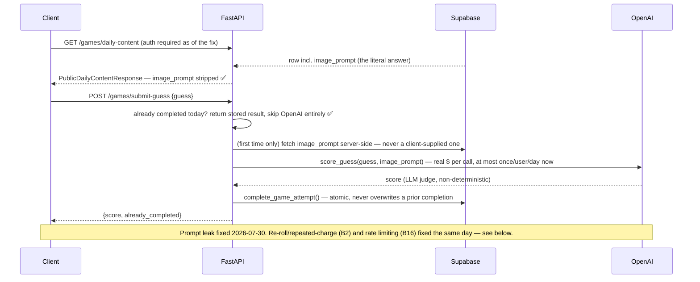

# Blipz Production & App Store Readiness Audit

**Date:** 2026-07-30
**Scope:** `blipz-backend` (FastAPI) + `blipz-ios/Blipz` (SwiftUI)
**Method:** Direct code inspection with file/line citations. Nothing below is speculative —
every finding was verified by reading the actual code, running `pytest`, checking `git`
history/`.gitignore`, or testing the live local server. Where something couldn't be verified
from code (e.g. Supabase dashboard access policy), that's stated explicitly rather than guessed.

This document does not implement fixes — per instruction, it's audit + roadmap only.

---

## 1. Current architecture



**Key architectural fact:** the backend authenticates every request via `app/auth.py`
(Supabase JWT verification), then talks to Postgres with the **secret/service-role key**
(`app/database.py`), which bypasses Row-Level Security entirely. This means **RLS policies on
`users`/`scores`/`friends`/`daily_content` provide zero real protection today** — the actual
(and only) security boundary is the FastAPI auth + authorization layer. This is fine *as long
as the iOS app never talks to Supabase directly* — confirmed it currently doesn't (all iOS
network calls go through `APIClient` → the FastAPI backend).

---

## 2. Data flow per game

### Quick Maths — data flow as it was before the 2026-07-30 fix



The grading logic itself is correct (server computes correctness, doesn't trust a
client-sent score) — the leak was entirely in what `GET /games/daily-content` exposed.

> **✅ Fixed 2026-07-30.** The endpoint now requires authentication and returns
> `PublicMathProblem`/`PublicTriviaQuestion`/`PublicDailyContentResponse` (see
> `app/models/schemas.py`) instead of the raw row. **`math_problems[].answer` is the one
> field intentionally kept** — Quick Maths' "type the correct number to auto-advance"
> mechanic checks answers on-device with no network round trip per keystroke, and
> redesigning that was explicitly out of scope for this fix. This remains a documented,
> accepted residual risk: a client can still read `answer` and submit a perfect Maths
> score without playing. Trivia and Guess no longer have this problem at all (see below).

### Daily Trivia — ✅ fixed 2026-07-30 (answer leak), ✅ fixed 2026-07-31 (grading, see B24)

`trivia_questions[].answer` is no longer returned by `GET /games/daily-content` — the
endpoint now returns `PublicTriviaQuestion` (id/question/category/options only).
`/submit-trivia` was already grading server-side by re-fetching the real answers — but
**that grading was itself broken** (see **B24**): it compared submitted option text
against a stored option letter, which never matched for any real content. This was only
caught the next day, during live verification of an unrelated fix, not as part of this
2026-07-30 pass. `TriviaGameView`'s per-question correct/incorrect reveal (from an
earlier polish pass) was removed here since it depended on the client having `answer`;
it came back on 2026-07-31 as a post-submission review screen (`GET
/games/trivia-review`), which is also where the id-based grading fix's correctness is
now visible to the player.

### AI Prompt Guess — ✅ fixed 2026-07-30 (prompt leak, and now B2/B16 below too)



---

## 3. Threat & failure-mode analysis

### Critical: game integrity is currently broken

| ID | Finding | File | Risk |
|----|---------|------|------|
| **B1** | ✅ **Fixed 2026-07-30.** `GET /games/daily-content` was fully unauthenticated and returned `trivia_questions[].answer` and `image_prompt` (the Guess answer) in plaintext, before the user played. Now requires auth and returns allowlisted `Public*` response models with those fields stripped. `math_problems[].answer` is intentionally still returned (documented exception — see the Quick Maths data-flow section above); everything else about the original finding is closed. Regression tests: `tests/test_daily_content_security.py`. | `app/routers/games.py`, `app/models/schemas.py` | Residual: a client can still read `math_problems[].answer` and submit a perfect Maths score without playing — accepted, not fixed, by design (see rationale above). |
| **B2** | ✅ **Fixed 2026-07-30.** `submit_guess`/`submit_maths`/`submit_trivia` now all go through `complete_game_attempt()`, which checks completion state before writing and uses an atomic conditional UPDATE (`.eq(completed_field, False)`) as a compare-and-swap guard — a repeated submission returns the original stored result (`already_completed: true`) instead of recomputing or overwriting. Guess specifically also checks-before-calling-OpenAI, so a resubmit never re-charges. Residual: in a narrow true-concurrency window (two requests both pass the check before either writes), a handful of extra OpenAI calls could still fire, though only one result is ever persisted — closing that fully would need a distributed lock, not added given the backend isn't hosted yet. **Pre-production follow-up tracked, not yet implemented — see B23 below.** Tests: `tests/test_daily_attempt_enforcement.py`. | `app/routers/games.py` (`complete_game_attempt`) | Residual: bounded extra-OpenAI-call risk in a millisecond-scale race window; no re-roll or storage corruption possible either way. |
| **B23** | **Pre-production follow-up (not yet implemented).** The Guess concurrency-cost window (B2's residual risk) should be closed before launch by reserving the user's daily Guess attempt atomically *before* calling OpenAI — e.g. an atomic conditional INSERT/UPDATE that flips `guess_completed`-style reservation state first, so only the request that wins that reservation is allowed to call OpenAI at all. Concurrent losers should wait for (or immediately return) the stored/in-flight result rather than each racing to call the API. This eliminates the "several concurrent requests all pass the check before any of them write" case entirely, rather than just bounding its damage. Deliberately **not implemented in the 2026-07-30 slice** — the current check-then-CAS design already prevents duplicate stored scores and any storage corruption; this follow-up only tightens the OpenAI-cost bound and was scoped out to avoid unnecessary churn before the backend is even hosted. | `app/routers/games.py` (`submit_guess`, `complete_game_attempt`) | Until implemented, a true concurrent double-submit can still trigger more than one OpenAI call (bounded, not unbounded) even though only one score is ever persisted. |
| **B24** | ✅ **Fixed 2026-07-31. Release blocker.** `/submit-trivia` graded by comparing the submitted answer against `daily_content.trivia_questions[].answer`, which was always stored as an option **letter** (`"A"`/`"B"`/`"C"`/`"D"`) — but iOS submitted the full **option text** the user tapped (e.g. `"Renegade"`). `"Renegade" == "A"` never matched, so **every real (non-placeholder-content) Trivia attempt was graded wrong regardless of what the player picked**, since the very first commit that implemented Trivia scoring (`ebae4c4`). It went undetected because two early dev-data days happened to use placeholder content whose options were literally the strings `"A"/"B"/"C"/"D"`, which could coincidentally match the stored letter. Fixed by changing the contract: `daily_content` questions are now normalized at generation time to `{id, question, category, options, correct_option_id}` (see `content_generator.normalize_trivia_questions` — also validates exactly 4 unique non-empty options and a real A-D answer, retrying generation once on malformed model output); the client submits `{question_id, selected_option_id}` pairs (`selected_option_id` pattern-validated to `^[A-D]$`); the backend grades by comparing ids, never text, and rejects submissions with missing/duplicate/extra/unknown `question_id`s. `GET /games/trivia-review` now returns both the id and human-readable text for the selected and correct answers. Old daily_content rows generated before this fix (using `answer` instead of `correct_option_id`, no `id`) still read correctly via a positional fallback — no content backfill needed. Regression tests: `tests/test_trivia_grading.py`, `tests/test_content_generator.py`. Live-verified against real (non-placeholder) content: a real authenticated submission of the actual correct option text, mapped to its position's id, scored 5/5. | `app/agents/content_generator.py`, `app/models/schemas.py`, `app/routers/games.py` | Historical dev data: one `scores` row (2026-07-30, `trivia_score=2`) was graded under the broken logic and its raw answers were never stored (`trivia_answers` predates this row), so it cannot be reconstructed — recommended cleanup is to zero out just that row's Trivia fields (see §5). No production users existed at the time of this bug — nothing to notify or refund. |
| **B3** | Guess scoring interpolates the raw player-supplied guess text directly into the LLM prompt with no delimiter/sanitization. | `app/agents/guess_scorer.py:44` | Prompt-injection vector — a crafted guess could attempt to manipulate the judge into returning a maximal score. |

### Daily content pipeline

| ID | Finding | File | Risk |
|----|---------|------|------|
| **B4** | No retry, fallback, or alerting if any of the 3 sequential OpenAI calls in `generate_daily_content()` fails (timeout, content-policy refusal, malformed response exhausting the existing regex fallback). Scheduler catches the exception and only logs it — no re-schedule, no notification. | `app/agents/content_generator.py`, `app/scheduler.py:21-22` | A single OpenAI hiccup leaves **the entire day broken for every user**, with nobody aware until someone notices manually (as happened during this session's own testing). |
| **B5** | `AsyncIOScheduler` uses the default in-memory job store with no misfire/catch-up handling. If the process isn't running at exactly 00:00 local (machine asleep, deploy in progress, crash), the job simply never fires — confirmed directly this session. | `app/scheduler.py` | Same failure mode as B4, triggered by infrastructure rather than OpenAI. |
| **B6** | No content moderation step before publishing the AI-generated image/prompt to all users. | `app/agents/content_generator.py` | OpenAI's own image-gen safety system provides some protection (surfaces as B4's failure mode if triggered), but there's no app-level review/reporting mechanism — likely an App Review question for AI-generated user-facing content. |
| **B7** | No pre-generation buffer — content is generated synchronously, exactly at the deadline, with real OpenAI calls sitting in the critical path. | `app/scheduler.py` (`CronTrigger(hour=0, minute=0)`) | No margin for retry between failure and the day's release; compounds B4/B5. |

### Authentication & identity

| ID | Finding | File | Risk |
|----|---------|------|------|
| **B8** | `signInIfNeeded()` uses `try?` around session restoration; if the stored session fails to restore/refresh for *any* reason (revoked refresh token, Keychain wipe, device restore — not just reinstall), it silently falls through to `signInAnonymously()`, minting a **brand-new identity**. There is no account-linking/upgrade flow anywhere. | `Blipz/Services/AuthManager.swift:19-28` | Permanent, silent loss of streak/scores/friends with no warning and no recovery path. This is the single biggest identity-durability risk in the app. |
| **B9** | If sign-in fails entirely, `isReady = true` still executes unconditionally, so the app renders `MainTabView` with no valid session — every API call then fails with an opaque `"Unknown server error"`. | `AuthManager.swift:27`, `APIClient.swift:38-42` | Broken app state with no retry UI, would look like a crash-adjacent bug to App Review or real users. |
| **B10** | JWT verification itself is done correctly (real JWKS, explicit `ES256` allowlist, audience check) — **no finding here**, called out so it's not mistaken for a gap. | `app/auth.py:17,31-32` | — |

### Social features

| ID | Finding | File | Risk |
|----|---------|------|------|
| **B11** | Adding a friend is unilateral — no request/accept step, no notification, and **no unfriend/block endpoint exists at all**. Any user can add anyone (if they know/guess the username) and permanently see that person's daily scores. | `app/routers/friends.py` (only `/add` and `/list` exist) | Non-consensual visibility relationship with no removal path — a real privacy problem and a plausible App Review rejection reason for social features. |
| **B12** | Add-friend returns 404 for unknown usernames vs 200 for known ones, allowing username enumeration; compounds B11. | `app/routers/friends.py:13-15` | Low-effort scraping of which users exist, then friending/viewing them. |
| **B13** | No endpoint anywhere lets a user change their username — permanently stuck with the auto-generated `guest_XXXXXXXX` handle. | confirmed absent in `app/routers/users.py`, `friends.py` | Product gap that meaningfully hurts a social/leaderboard-driven app (nobody wants to be "guest_d366ce2a" forever). |

### Operational readiness

| ID | Finding | File | Risk |
|----|---------|------|------|
| **B14** | No hosting/deploy config of any kind exists (no `fly.toml`/`render.yaml`/`Procfile`/CI workflow) — only a `Dockerfile`. The backend has never been deployed anywhere. | repo-wide (confirmed absent) | App Review cannot use the app at all in its current state — it points at `127.0.0.1`. |
| **B15** | `CORSMiddleware` is configured with `allow_origins=["*"]` **and** `allow_credentials=True` simultaneously — a real misconfiguration (browsers/spec discourage this combination), and clearly a dev-only setting never locked down. | `app/main.py:26-31` | Security misconfiguration; must be scoped to the real production origin(s) before launch. |
| **B16** | ✅ **Partially fixed 2026-07-30.** `POST /games/submit-guess` now has `@limiter.limit("10/minute")` (slowapi, keyed by IP). Still no rate limiting on any other route. Uses slowapi's default in-memory storage — **not sufficient once the backend runs on more than one process/instance** (each instance tracks its own counter independently); revisit with a shared store (e.g. Redis) before scaling out. Also keyed by IP, not authenticated user, as a simplification — doesn't perfectly isolate abuse by one user across IPs or protect users sharing an IP/NAT. | `app/rate_limit.py`, `app/routers/games.py` | Cost/abuse exposure remains on every other route; the fixed route's protection weakens under multi-instance deployment. |
| **B17** | No logging/error-tracking/alerting beyond stdout. Scheduler failures (B4/B5) are invisible unless someone manually checks logs. | repo-wide (no Sentry/structlog/etc.) | Nobody gets paged when the daily content pipeline breaks. |
| **B18** | No `PrivacyInfo.xcprivacy` exists in the iOS app target. | confirmed absent, `Blipz/` | Apple requires this; App Store Connect submission will flag it. |
| **B19** | No account-deletion flow exists anywhere in the iOS app (no settings screen, not even sign-out). | confirmed absent, `Blipz/Views/` | Apple App Review Guideline 5.1.1(v) requires in-app account deletion for apps that support account creation — anonymous Supabase accounts likely qualify. |
| **B20** | `Config.swift` hardcodes `apiBaseURL = http://127.0.0.1:8000`. | `Blipz/Services/Config.swift:8` | Any TestFlight/App Review build currently points at a dead loopback address — compounds B14. |
| **B21** | iOS deployment target is `IPHONEOS_DEPLOYMENT_TARGET = 26.0` with no code dependency found that requires it. | `project.pbxproj` | Needlessly excludes the large majority of real-world iOS users for a v1.0 launch. |
| **B22** | Daily reset boundary is still server-local time with no explicit timezone anywhere (`date.today()`), a known gap noted in earlier planning and never resolved. | `app/routers/games.py`, `app/agents/content_generator.py` | For real users across timezones, "today" resets at an arbitrary, undocumented moment — affects fairness and the (currently absent, correctly so) reset-countdown UI. |

### Confirmed non-issues (checked, no finding)

- OpenAI key never reaches the client or logs — clean (`app/config.py`, grep for key patterns).
- No hardcoded secrets in the iOS app beyond the intentional public Supabase key (`Config.swift`).
- No SQL injection surface — everything goes through the parameterized supabase-py query builder.
- No over-exposure of private fields (email, etc.) to other users via leaderboard/friends.
- `.env` is correctly gitignored and has never been committed (`git log --all -- .env` empty).
- Global leaderboard is already capped (`LIMIT 50`) — not an unbounded-fetch risk.
- Friends-leaderboard authorization correctly scopes to the requesting user's own `user_id` from the verified JWT — no cross-user data leak found there.

---

## 4. App Store release-blocker list

These must be fixed before any TestFlight/App Review submission, in rough order of how much
they block everything else:

1. ~~**B1** — public endpoint leaks all three games' answers.~~ **✅ Fixed 2026-07-30**
   (Trivia/Guess fully; Maths answer intentionally kept, see finding B1 above). (Backend)
2. ~~**B24** — Trivia graded submitted option text against a stored option letter,
   silently scoring every real attempt wrong.~~ **✅ Fixed 2026-07-31** — see B24 above.
   (Backend + iOS)
3. **B14 + B20** — no hosted backend; app points at localhost. (Deployment + iOS)
4. **B19** — no account-deletion flow. (iOS + Backend)
5. **B18** — no `PrivacyInfo.xcprivacy`. (iOS)
6. **B8** — silent identity loss on session-restore failure, no recovery. (iOS)
7. **B11** — non-consensual, unremovable friending. (Backend + iOS)
8. **B15** — wildcard CORS + credentials. (Backend)
9. **B17** — no alerting on scheduler failure. (Backend)
10. ~~**B2 + B16** — unlimited OpenAI cost exposure via unthrottled `submit-guess`.~~
    **✅ Fixed 2026-07-30** (Backend) — rate limiting still needed on other routes; see B16 above.
11. **B4 + B5 + B7** — content pipeline has no retry/fallback/buffer. (Backend)

---

## 5. Recommended database/schema changes

- ✅ **Done 2026-07-30**: added `maths_completed`, `guess_completed`, `trivia_completed`
  boolean columns to `scores` (plus `maths_elapsed_seconds`, `guess_text`,
  `trivia_answers` for the Maths plausibility check, idempotent Guess replay, and
  Trivia review respectively), set explicitly by `complete_game_attempt()` at the
  moment of a genuine first completion and never overwritten after. This is a
  **transitional design**, not the full `daily_game_attempts` table originally
  sketched here — see the design-rationale note in `sql/migrations.sql` for why: the
  leaderboard, streak, and Today/Profile read paths are all built around one flat
  `scores` row per user/day, and reworking that aggregation was disproportionate churn
  relative to what closing the actual security gap required. Revisit if per-attempt
  history/analytics become a real product need later.
- Consider a `friends` table `status` column (`pending`/`accepted`) to support a real
  request/accept flow (fixes B11), plus the missing `DELETE /friends/{id}` endpoint.
- Add a `username` uniqueness/change audit if usernames become editable (fixes B13) —
  confirm the existing `UNIQUE` constraint semantics are preserved.
- Longer-term (not a blocker): a per-attempt table (`user_id, daily_content_id, game_type,
  started_at, completed_at, score`) for real analytics and anti-cheat signal, as originally
  suggested.
- **Historical dev-data audit (B24, 2026-07-31)**: of the 2 rows in `scores` at the time of
  the fix, one (`id=5b92729d-5e7a-4524-bfe4-134430c47349`, `date=2026-07-30`,
  `trivia_score=2`, `trivia_completed=true`) was graded under the broken text-vs-letter
  comparison. Its `trivia_answers` is `NULL` (the row predates that column's population),
  so there is no record of what was actually submitted — **reconstruction is not
  possible** by any of stored answers, daily content, or question ordering. The row's
  `maths_score`/`maths_completed`/`guess_score`/`guess_completed` are untouched by this
  bug and were left alone. Since the app has no production users yet, the recommended
  (not yet executed — pending approval) cleanup is to zero out only that row's Trivia
  fields rather than guess a score or delete the whole row:
  ```sql
  UPDATE scores
  SET trivia_score = 0,
      trivia_completed = false,
      trivia_answers = NULL,
      total_score = maths_score + guess_score
  WHERE id = '5b92729d-5e7a-4524-bfe4-134430c47349';
  ```
  The other row (2026-07-29) already has `trivia_completed=false`/`trivia_score=0` and
  needs no change.

---

## 6. Recommended hosted deployment architecture

Given the current stack (FastAPI + Docker + Supabase + OpenAI, no existing infra investment):

- **Backend hosting:** Fly.io or Render — both have a straightforward path from the existing
  `Dockerfile`, support secrets management (env vars, not baked into the image), and offer
  basic health checks. Either is a reasonable choice; pick based on whichever the team already
  has familiarity with. Add a `HEALTHCHECK` to the Dockerfile and stop running as root (fixes
  part of the Dockerfile finding).
- **Scheduler reliability:** move the midnight job off in-process `APScheduler` (which dies
  with the process) to the hosting platform's own cron/scheduled-job feature hitting the
  existing admin-token-protected `POST /games/generate-daily-content` endpoint. This alone
  fixes B5 without any application code change — the endpoint already exists and is
  authenticated correctly.
- **Environment separation:** introduce an `ENVIRONMENT` setting (`development`/`production`)
  in `app/config.py`, and branch `CORSMiddleware`'s `allow_origins` off it (fixes B15) — allow
  `*` only in development, a real allowlist (App Store app's origin isn't applicable here since
  it's a native app calling a fixed API host, so this mainly matters for any web/admin surface).
- **Observability:** add Sentry (or similar) for exception tracking on both the API routes and
  the scheduler job specifically — the scheduler's existing `logger.exception()` call is the
  natural hook point (fixes B17).
- **Secrets:** move `OPENAI_API_KEY`, `SUPABASE_SECRET_KEY`, `ADMIN_TOKEN` into the hosting
  platform's secret manager rather than a shipped `.env` (still fine for local dev).

---

## 7. Ordered implementation roadmap

1. ~~**Fix B1 (answer leak)**~~ **✅ Done 2026-07-30** — Trivia's `answer` and Guess's
   `image_prompt` no longer appear in the public payload; the endpoint now requires auth.
   Maths' `answer` stays exposed by design (see rationale above).
2. ~~**Fix B2 + add submission guards**~~ **✅ Done 2026-07-30** — resubmission now
   returns the original result instead of overwriting (see §5's schema change).
3. **Deploy the backend** (fixes B14) — pick Fly.io/Render, wire the existing Dockerfile,
   move the scheduler to the platform's cron hitting the admin endpoint (fixes B5 for free).
4. **Point iOS at the real backend URL** (fixes B20) — make it environment-driven, not hardcoded.
5. **Lock down CORS** (fixes B15) once a real environment split exists.
6. **Add account deletion** (fixes B19) — iOS settings entry point + backend endpoint that
   removes/anonymizes the user's rows across `users`/`scores`/`friends`.
7. **Add `PrivacyInfo.xcprivacy`** (fixes B18) reflecting the actual data collected (User ID,
   username, scores) — straightforward now that the data model is well understood.
8. **Fix identity durability** (B8/B9) — surface a real error/retry UI instead of silently
   minting a new identity; account-linking is a bigger future project, but at minimum stop the
   silent data loss.
9. **Friends: add accept/decline + unfriend** (fixes B11/B12).
10. **Add basic rate limiting** (fixes B16) on `submit-guess` at minimum.
11. **Add Sentry/error tracking** (fixes B17) for the scheduler and API.
12. **Content pipeline hardening** (B4/B6/B7) — pre-generate a few hours early, add a retry
    with backoff, add a minimal moderation check before publish.
13. **Lower iOS deployment target** (fixes B21) unless a specific API dependency is found.
14. **Decide and document the daily-reset timezone** (fixes B22) — likely UTC, needs an
    explicit decision recorded, not just left implicit.
15. **Username editability** (fixes B13) — product improvement, not a blocker, but cheap
    relative to its value once the account model is otherwise stable.
16. **Close the Guess concurrency-cost window** (fixes B23) — reserve the daily Guess
    attempt atomically before calling OpenAI, so only the reservation-winning request may
    call the API; concurrent losers wait for or return the stored/in-flight result instead
    of each calling OpenAI independently. Pre-production follow-up; not required for B2's
    core correctness guarantee (no duplicate scores, no storage corruption), only for
    tightening the bounded extra-OpenAI-call risk.

---

## 8. Suggested TestFlight acceptance criteria

Before inviting external testers:

- [ ] Backend is reachable at a real HTTPS URL from outside the local network (B14/B20)
- [x] `GET /games/daily-content` no longer exposes Trivia's answer or Guess's
      image_prompt (B1, fixed 2026-07-30) — Maths' answer remains, by design
- [x] Each game can only be scored once per day per user, server-enforced (B2, fixed
      2026-07-30) — pending live verification of `tests/test_daily_attempt_enforcement.py`
      once the migration is applied in this environment (currently skipped, not failing)
- [ ] A missed/failed daily-content generation sends a real alert, not just a log line (B17)
- [ ] Session-restore failure shows a real error/retry state, not a silently new identity (B8/B9)
- [ ] CORS is no longer wildcard-open in whatever environment testers hit (B15)
- [ ] Basic rate limiting exists on `submit-guess` (B16)

## 9. Suggested App Store submission checklist

- [ ] `PrivacyInfo.xcprivacy` present and accurate (B18)
- [ ] In-app account deletion implemented and tested end-to-end (B19)
- [ ] Friends require some form of consent, and can be removed (B11)
- [ ] Privacy policy URL set in App Store Connect and reachable
- [ ] Deployment target reviewed for real-world device coverage (B21)
- [ ] App Review can complete the full daily loop (sign in → play all 3 → leaderboard →
      friends → profile) against the live production backend
- [ ] Screenshots, description, keywords, support URL prepared (currently not started)
- [ ] Content-moderation/reporting story documented for the AI-generated daily image (B6)
